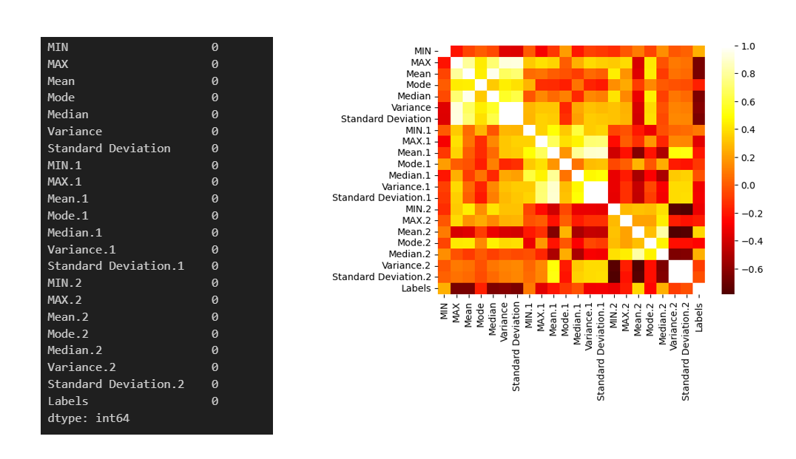
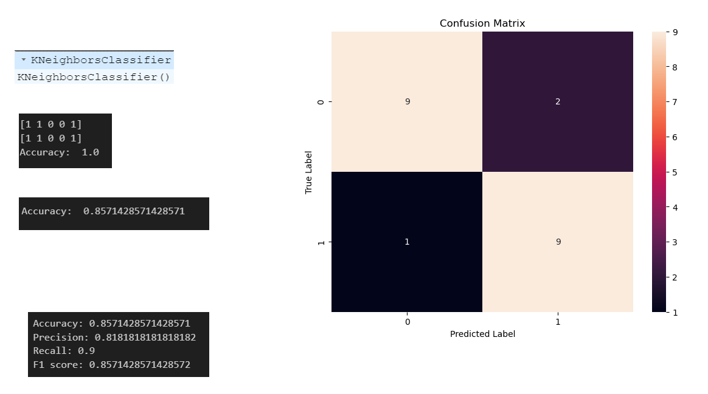
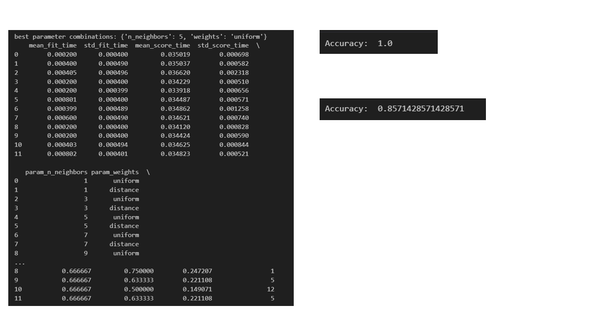
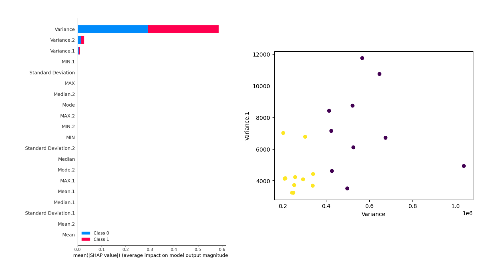

# Project2
 Exploratory Data Analysis and Machine Learning Classifier

 The file name is 3009_KNN
# Project Overview
This project involves conducting exploratory data analysis (EDA) and applying machine learning classifiers on datasets labeled F1 to F10. The objective is to build, optimize, and evaluate classifiers, as well as to use SHAP values for feature importance analysis. The final outcome includes identifying the best-performing model and key influential features.

Project Steps
1. Data Exploration and Visualization
Load the datasets (F1-F10) into the analysis environment.
Perform exploratory data analysis to understand data characteristics.
Visualize data distributions using histograms, boxplots, and other visualization tools.
Identify patterns, trends, or anomalies within the data.

2. Classification
Implement multiple classifiers (e.g., K Nearest Neighbor, Support Vector Machine, etc.) on the dataset.
Evaluate the performance of each classifier using metrics like accuracy, precision, recall, and F1 score.
Compare the classifiers' performance and select the best-performing ones.

4. Hyperparameter Optimization (Grid Search)
Perform grid search to optimize the hyperparameters for each classifier.
Use cross-validation to evaluate different combinations of parameters.
Report the best hyperparameters for each classifier.

6. SHAP Values for Feature Importance
Calculate SHAP values for the best-performing classifier.
Visualize and interpret SHAP values to understand which features are most influential in the model's predictions.
Use SHAP values to explain the model's decision-making process.

